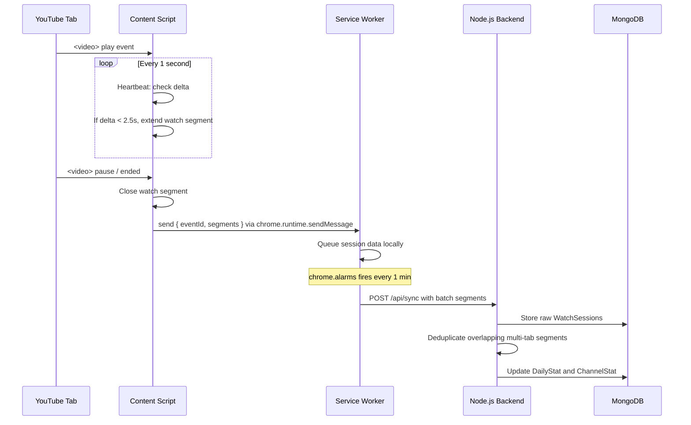

# YouTube Analytics Extension

A complete, production-grade analytics platform that tracks and visualizes your YouTube and YouTube Music watch history. Built with Manifest V3, Node.js, Express, and MongoDB.

## Project Structure

```text
Project/
├── backend/                  # Node.js + Express API
│   ├── config/db.js          # MongoDB connection
│   ├── controllers/          # API Controllers
│   │   ├── authController.js
│   │   ├── statsController.js
│   │   └── syncController.js
│   ├── middleware/           # JWT Auth middleware
│   │   └── authMiddleware.js
│   ├── models/               # Mongoose Schemas
│   │   ├── ChannelStat.js
│   │   ├── DailyStat.js
│   │   ├── User.js
│   │   └── WatchSession.js
│   ├── routes/               # Express Routes
│   │   ├── authRoutes.js
│   │   ├── statsRoutes.js
│   │   └── syncRoutes.js
│   ├── services/
│   │   └── aggregation.js    # Data merging and stats processing
│   ├── package.json
│   └── server.js             # Entry point
│
└── extension/                # Chrome Extension (MV3)
    ├── manifest.json         # Extension config
    ├── background.js         # Service Worker (Syncing & Alarms)
    ├── content.js            # Injected script (Heartbeat tracking)
    └── popup/                # Dashboard UI
        ├── chart.js          # Chart.js library (Local)
        ├── popup.css         # Modern dark theme styles
        ├── popup.html        # UI layout
        └── popup.js          # UI logic and API calls
```

## Example Data Flow Diagram



## Setup Instructions

### 1. Backend Setup

1. Open your terminal and navigate to the backend folder:
   ```bash
   cd path/to/Project/backend
   ```
2. Start your local MongoDB server (usually runs on `mongodb://127.0.0.1:27017`).
3. Create a `.env` file in the `backend` folder (optional) to set custom secrets:
   ```env
   PORT=5000
   MONGO_URI=mongodb://127.0.0.1:27017/youtube_analytics
   JWT_SECRET=your_super_secret_key
   JWT_REFRESH_SECRET=your_super_refresh_secret
   ```
4. Start the backend development server:
   ```bash
   npm run dev
   ```

### 2. Loading the Extension in Chrome

1. Open Google Chrome.
2. Navigate to `chrome://extensions/` in the URL bar.
3. Turn on **"Developer mode"** in the top right corner.
4. Click the **"Load unpacked"** button in the top left.
5. Select the `Project/extension` folder.
6. The "YouTube Analytics Pro" extension should now appear in your list. Pin it to your toolbar for easy access.

### 3. Usage Guide

1. Click the extension icon in your Chrome toolbar.
2. The popup will show a **Login/Register** view. Click **Register** to create a new account (e.g., username: `admin`, password: `password`).
3. Once logged in, open [YouTube](https://youtube.com) or [YouTube Music](https://music.youtube.com).
4. Watch a video! The extension tracks your watch time actively in the background. It will ignore fast-forwarding, skipping, and paused videos thanks to the heartbeat delta system.
5. Click the extension icon again to view the beautiful Chart.js Dashboard containing your updated analytics.
